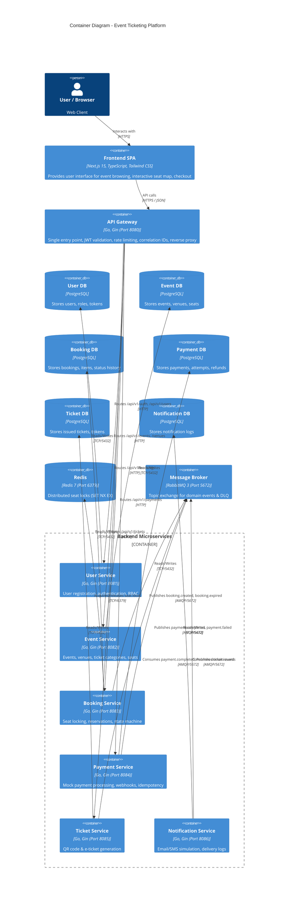

# Container Diagram (C4 Model - Level 2)

```mermaid
C4Container
    title Container Diagram - Event Ticketing Platform

    Person(user, "User / Browser", "Web Client")

    Container(frontend, "Frontend SPA", "Next.js 15, TypeScript, Tailwind CSS", "Provides user interface for event browsing, interactive seat map, checkout")

    Container(gateway, "API Gateway", "Go, Gin (Port 8080)", "Single entry point, JWT validation, rate limiting, correlation IDs, reverse proxy")

    Container_Boundary(services, "Backend Microservices") {
        Container(user_svc, "User Service", "Go, Gin (Port 8081)", "User registration, authentication, RBAC")
        Container(event_svc, "Event Service", "Go, Gin (Port 8082)", "Events, venues, ticket categories, seats")
        Container(booking_svc, "Booking Service", "Go, Gin (Port 8083)", "Seat locking, reservations, state machine")
        Container(payment_svc, "Payment Service", "Go, Gin (Port 8084)", "Mock payment processing, webhooks, idempotency")
        Container(ticket_svc, "Ticket Service", "Go, Gin (Port 8085)", "QR code & e-ticket generation")
        Container(notif_svc, "Notification Service", "Go, Gin (Port 8086)", "Email/SMS simulation, delivery logs")
    }

    ContainerDb(user_db, "User DB", "PostgreSQL", "Stores users, roles, tokens")
    ContainerDb(event_db, "Event DB", "PostgreSQL", "Stores events, venues, seats")
    ContainerDb(booking_db, "Booking DB", "PostgreSQL", "Stores bookings, items, status history")
    ContainerDb(payment_db, "Payment DB", "PostgreSQL", "Stores payments, attempts, refunds")
    ContainerDb(ticket_db, "Ticket DB", "PostgreSQL", "Stores issued tickets, tokens")
    ContainerDb(notif_db, "Notification DB", "PostgreSQL", "Stores notification logs")

    ContainerDb(redis, "Redis", "Redis 7 (Port 6379)", "Distributed seat locks (SET NX EX)")
    Container(rabbitmq, "Message Broker", "RabbitMQ 3 (Port 5672)", "Topic exchange for domain events & DLQ")

    Rel(user, frontend, "Interacts with", "HTTPS")
    Rel(frontend, gateway, "API calls", "HTTPS / JSON")

    Rel(gateway, user_svc, "Routes /api/v1/auth, /api/v1/users", "HTTP")
    Rel(gateway, event_svc, "Routes /api/v1/events, /venues", "HTTP")
    Rel(gateway, booking_svc, "Routes /api/v1/bookings", "HTTP")
    Rel(gateway, payment_svc, "Routes /api/v1/payments", "HTTP")
    Rel(gateway, ticket_svc, "Routes /api/v1/tickets", "HTTP")

    Rel(user_svc, user_db, "Reads/Writes", "TCP/5432")
    Rel(event_svc, event_db, "Reads/Writes", "TCP/5432")
    Rel(booking_svc, booking_db, "Reads/Writes", "TCP/5432")
    Rel(payment_svc, payment_db, "Reads/Writes", "TCP/5432")
    Rel(ticket_svc, ticket_db, "Reads/Writes", "TCP/5432")
    Rel(notif_svc, notif_db, "Reads/Writes", "TCP/5432")

    Rel(booking_svc, redis, "Acquires/releases seat locks", "TCP/6379")
    Rel(booking_svc, rabbitmq, "Publishes booking.created, booking.expired", "AMQP/5672")
    Rel(payment_svc, rabbitmq, "Publishes payment.completed, payment.failed", "AMQP/5672")
    Rel(ticket_svc, rabbitmq, "Consumes payment.completed, Publishes ticket.issued", "AMQP/5672")
    Rel(notif_svc, rabbitmq, "Consumes domain events", "AMQP/5672")
```
