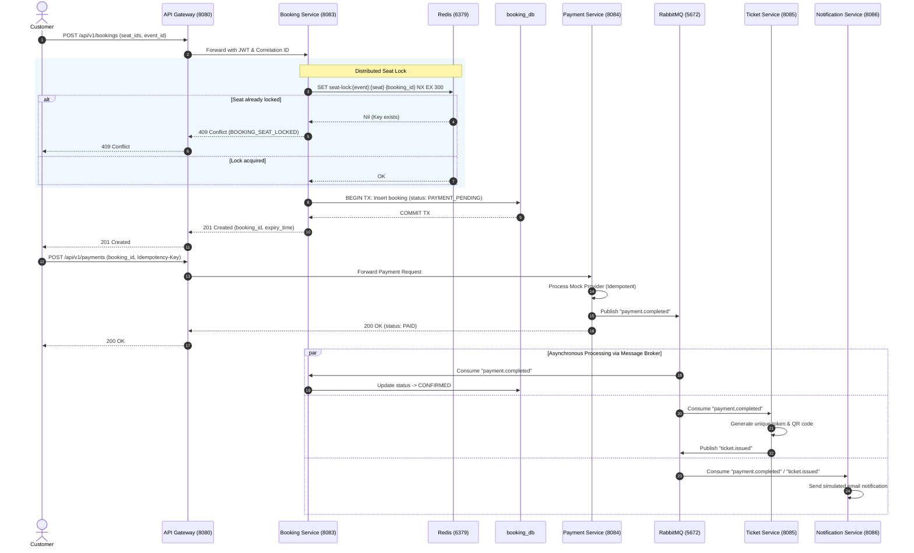

# End-to-End Data Flow & Sequence Diagram

## Customer Booking & Payment Lifecycle

```mermaid
sequenceDiagram
    autonumber
    actor Customer
    participant Gateway as API Gateway (8080)
    participant Booking as Booking Service (8083)
    participant Redis as Redis (6379)
    participant BookingDB as booking_db
    participant Payment as Payment Service (8084)
    participant RabbitMQ as RabbitMQ (5672)
    participant Ticket as Ticket Service (8085)
    participant Notif as Notification Service (8086)

    Customer->>Gateway: POST /api/v1/bookings (seat_ids, event_id)
    Gateway->>Booking: Forward with JWT & Correlation ID
    
    rect rgb(240, 248, 255)
        Note over Booking,Redis: Distributed Seat Lock
        Booking->>Redis: SET seat-lock:{event}:{seat} {booking_id} NX EX 300
        alt Seat already locked
            Redis-->>Booking: Nil (Key exists)
            Booking-->>Gateway: 409 Conflict (BOOKING_SEAT_LOCKED)
            Gateway-->>Customer: 409 Conflict
        else Lock acquired
            Redis-->>Booking: OK
        end
    end

    Booking->>BookingDB: BEGIN TX: Insert booking (status: PAYMENT_PENDING)
    BookingDB-->>Booking: COMMIT TX
    Booking-->>Gateway: 201 Created (booking_id, expiry_time)
    Gateway-->>Customer: 201 Created

    Customer->>Gateway: POST /api/v1/payments (booking_id, Idempotency-Key)
    Gateway->>Payment: Forward Payment Request
    Payment->>Payment: Process Mock Provider (Idempotent)
    Payment->>RabbitMQ: Publish "payment.completed"
    Payment-->>Gateway: 200 OK (status: PAID)
    Gateway-->>Customer: 200 OK

    par Asynchronous Processing via Message Broker
        RabbitMQ->>Booking: Consume "payment.completed"
        Booking->>BookingDB: Update status -> CONFIRMED
    and
        RabbitMQ->>Ticket: Consume "payment.completed"
        Ticket->>Ticket: Generate unique token & QR code
        Ticket->>RabbitMQ: Publish "ticket.issued"
    and
        RabbitMQ->>Notif: Consume "payment.completed" / "ticket.issued"
        Notif->>Notif: Send simulated email notification
    end
```
